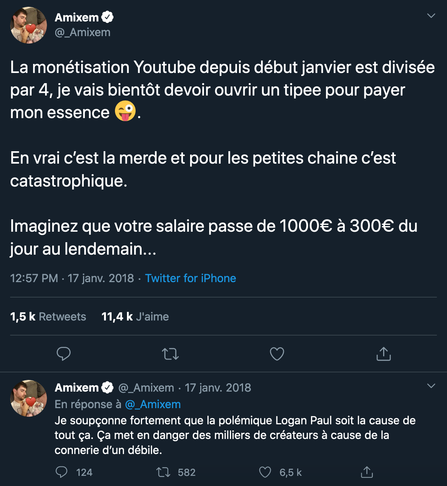
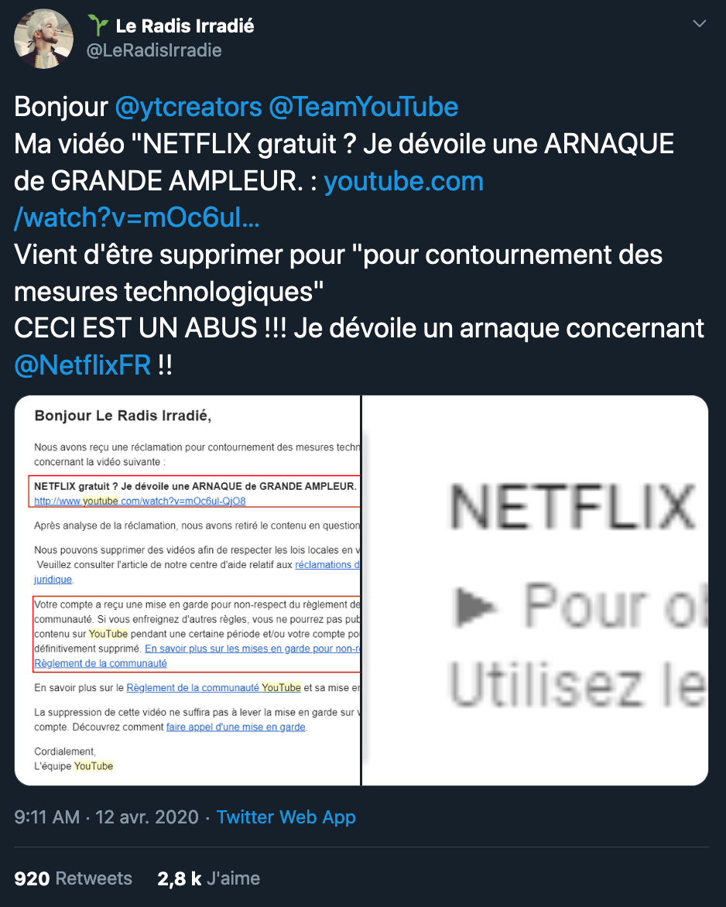

# Analyse de l'existant

La vidéo est omniprésente dans notre utilisation quotidienne d'Internet. Nous savons qu'une vidéo permet de partager des idées, des opinions ou simplement divertir en y mettant la forme que l'on souhaite. Souvent inspirés des formats télévisés, la création de vidéo est aujourd'hui une activité qui s'est énormément démocratisée, grâce à Internet. YouTube, l'un des premiers acteurs à avoir ouvert la voie est aujourd'hui le leader du marché du partage de vidéo. Autant destiné aux particuliers qu'aux professionnels, YouTube propose de nombreuses fonctionnalités qui le rendent indétrônable.

#### Avantages

Parmis les avantages concurrentiels que la plateforme de Google propose, nous pouvons identifier les suivants :

- **Popularité**: Le trafic quotidien rend les plateformes très intéressantes pour la visiblité des créateurs.
- **Stabilité et performances**: La stabilité technique de ces services permet de garantir un confort non négligeable pour les utilisateurs, y compris pour les sociétés réclamant un service de qualité gratuitement.
- **Proximité avec la communauté**: Ces services offrent généralement une bonne proximité avec les personnes qui nous suivent.
- **Modèle économique simple**: Le modèle de la publicité en ligne est très simple à utiliser puisqu'il ne nécessite aucune action spécifique de la part de l'utilisateur.
- **Fonctionnalités nombreuses**: Les fonctionnalités proposées sont très avantageuses et permettent aux créateurs de visualiser leurs données, leur revenus ou de créer davantage. Les vidéos peuvent également être intégrées très facilement sur un site externe.
- **Opportunités professionnelles**: Ces dernières années, les opportunités de se professionnaliser en tant que créateur de vidéo se sont multipliées. YouTube propose notamment de nombreux avantages pour fidéliser les utilisateurs réalisant le plus d'audience. Notamment avec le [YouTube Space](https://www.youtube.com/space/), un studio de tournage mis à disposition des créateurs.
- **Ressources nombreuses**: YouTube met de nombreuses ressources à disposition des créateurs pour les aider à tirer le meilleur de leur contenu.

#### Désavantages

- **Manque de transparence et d'éthique:** Il n'y a aucun moyen de savoir comment fonctionne les plateformes, leur façon de modérer le contenu et de traiter les données utilisateur.
- **L'apprentissage machine rend la modération inefficace**: Les grandes sociétés se tournent de plus en plus vers l'apprentissage machine (dite Intélligence Artificielle) pour modérer le contenu automatiquement. Le résultat s'est montré peu glorieux: des vidéos bloquées par erreur, du contenu offensant non détecté, des mots censurés sans raison etc. Par ailleurs, cs algorithmes ne sont pas transparents, ne permettant pas à l'utilisateur de voir comment ses préférences sont ajustées.
- **Modèle économique instable**: Puisque ce sont les annonceurs qui alimentent le modèle économique, leurs décisions ont de grands impacts sur la capacité de la rémunération. Lorsqu'un type de vidéo ne plait pas aux annonceurs, ils peuvent décider de ne pas afficher leur publicité sur ces dernières, les rendant non monétisables par la plateforme.
- **L'algorithme de recommandation peine à trouver du contenu de qualité**: YouTube pousse de moins en moins à la découverte de créateurs, produisant un vrai travail. La plateforme ne s'adapte pas aux centres d'intérêts de l'utilisateurs mais aux centres d'intérêts de tous en même temps.
- **Manque de personnalisation**: L'utilisateur ne contrôle pas comment les vidéos lui sont recommandées, ni le contenu qu'il souhaite voir sur sa page d'accueil. La majorité des recommandations sont basées sur l'audience et l'engagement. Poussant notamment les créateurs à réaliser fréquemment du contenu qui pousse au clique.

Sans se limiter à YouTube cette fois-ci, nous pouvons observer que parmis les sondés, les avis des utilisateurs sur la plateforme qu'ils utilisent sont mitigés.

### Ce qu'en disent les créateurs

Avec le modèle économique actuel de YouTube, ce sont les annonceurs qui ont le pouvoir sur la rémunération des créateurs de contenu. De ce fait, à cause de polémiques comme [celle autour du YouTuber Logan Paul][8] par exemple, les annonceurs se sont montrés plus réticents envers YouTube, car ils ne veulent pas que leur image de marque soit assimilée comme étant en accord avec ce type de contenu. YouTube se voit donc dans l'obligation de diminuer les seuils de monétisation et de réstreindre l'accès à celle-ci avec des critères plus précis.

[Tweet d'Amixem, vidéaste français][7] [[archive][7_archive]]

----

Le 12 Avril 2020, Le Radis Irradié, un vidéaste français explique s'être fait censuré par YouTube pour une vidéo postée 2 jours plus tôt. Selon YouTube, sa vidéo dénoncant une arnaque sur Internet, ne respectait pas les règles de la communauté.

[Tweet de "Le Radis Irradié", vidéaste français][9] [[archive][9_archive]]

Peu après ce tweet, une vidéo est publiée sur YouTube par Le Radis Irradié pour expliquer les faits à sa communauté. Il explique notamment qu'après de nombreux partages, son cas a finalement pu être remonté aux équipes de modération de la plateforme et qu'il s'agit bien d'une erreur. Une erreur qui aurait cependant pu lui coûter le droit de monétiser d'autres vidéos, voire même d'en publier.

<iframe width="560" height="315" src="https://www.youtube-nocookie.com/embed/34-KiobBdDM" frameborder="0" allow="accelerometer; autoplay; encrypted-media; gyroscope; picture-in-picture" allowfullscreen></iframe>

Bien entendu, nombreux sont les créateurs qui sont satisfaits de YouTube et n'ont aucun problème avec la plateforme qui leur apporte confort et stabilité. La plateforme fait de nombreux efforts pour apporter de la nouveauté à travers de nouvelles fonctionnalités et plus grande transparence. Cependant depuis quelques années, les avis mécontents se sont multipliés et les problèmes de censure, monétisation, ou encore de modération sont chaque années plus nombreux.

### Ce qu'en dit la presse

#### Monétisation

Le 25 Novembre 2019, un article parait sur l'ADN à propos des créateurs subissants la pression de YouTube concernant la monétisation de leurs vidéos. Expliquant que ces derniers doivent avoir recours à l'aide de leur communauté pour continuer à vivre de cette activité.

    <a href="https://web.archive.org/web/20200229093359/https://www.ladn.eu/media-mutants/tv-et-nouvelles-images/comment-youtubeurs-font-financer-communaute/" target="_blank">Article de David-Julien Rahmil sur l'ADN</a>

>Imaginez que chaque matin vous alliez au travail sans vraiment savoir ce qu’on attend de vous. Vos horaires de bureau changent tout le temps et vous effectuez des tâches sans savoir si c’est ce que votre boss attend de vous. Par ailleurs, ce dernier ne vous paye jamais la même somme et change les termes de votre contrat sans vous dire vraiment quelles sont les règles précises. Tout ce que vous savez, c’est qu’il faut toujours produire plus, pour espérer lui plaire et assurer un salaire minimum pour vivre.

#### Évolution du métier de vidéaste

Dans un [autre article paru le 16 Mai 2019](https://www.ladn.eu/media-mutants/tv-et-nouvelles-images/amixem-youtube-surtout-plaire-algorithme/) sur l'ADN, [Amixem](https://www.youtube.com/user/FPSCoopGameplays), un vidéaste français, raconte comment son métier a évolué.

>Les règles du jeu ne sont plus du tout les mêmes. La première chose à prendre en compte, c’est bien évidemment l’algorithme de YouTube. On peut même dire qu’il a un pouvoir de vie ou de mort sur les youtubeurs.

>Le but pour YouTube est de garder les internautes le plus de temps possible sur la plateforme. Ils vont donc regarder le nombre de minutes visionnées pour chaque vidéo. Si les gens restent plus longtemps, alors ton contenu est davantage propulsé. Avec ce système, on ne peut pas vraiment tricher.

#### Censure et modération

*"Quand la censure de Youtube va trop loin"*, [cet article de  Marion Jaumotte sur RTBF][10] en Juin 2019, raconte comment des historiens on vu leurs vidéos supprimées à cause d'un mauvais ajustement dans l'algorithme de modération.

>La modération faite par des algorithmes a démontré ses limites en censurant tout un tas de vidéos de youtubeurs et d’historiens.

>Depuis que Youtube a durci sa politique relative aux contenus faisant l’apologie des propos haineux, de la discrimination ou de la ségrégation, certains youtubeurs et professeurs d’histoire tirent la sonnette d’alarme car leur contenu à caractère éducatif a également été supprimé…

----

Les problèmatiques qui émanent de la plateforme de Google sont nombreuses et beaucoup relayés via la presse et les réseaux sociaux. Bien que nous nous sômmes concentrés sur le négatif, il ne doit être négligé que YouTube apporte des ressources et un confort de visionnage suffisamment conséquent pour que ces vidéastes continuent d'utilise la plateforme de Google, malgré les difficultés qu'ils rencontrent.

----

### Ressources

- [L’ADN : “YouTube burn-out : les vidéastes cherchent des portes de sortie”][1] [[archive][1_archive]]
- [Les echos “La grogne des youtubeurs face aux nouvelles règles de monétisation”][2] [[archive][3_archive]]
- [Numerama : dans la peau des petits vidéastes qui n’ont jamais percé sur YouTube][3] [[archive][3_archive]]
- [L’ADN : Comment les youtubeurs se font financer par leur communauté][4] [[archive][4_archive]]
- [Interview du youtubeur Amixem : sur YouTube il faut plaire à l'algorithme][5] [[archive][5_archive]]
- [Joueur du Grenier : “Youtube m'ennuie.”][6]
- [Quand la censure de Youtube va trop loin][10] [[archive][10_archive]]

[1]:https://www.ladn.eu/media-mutants/tv-et-nouvelles-images/comment-youtubeurs-font-financer-communaute/
[1_archive]:https://www.ladn.eu/media-mutants/tv-et-nouvelles-images/comment-youtubeurs-font-financer-communaute/

[2]:https://start.lesechos.fr/innovations-startups/tech-futur/la-grogne-des-youtubeurs-face-aux-nouvelles-regles-de-monetisation-11623.php
[2_archive]:https://start.lesechos.fr/innovations-startups/tech-futur/la-grogne-des-youtubeurs-face-aux-nouvelles-regles-de-monetisation-11623.php

[3]:https://www.numerama.com/pop-culture/510021-remuneration-difficile-manque-de-reconnaissance-les-petits-videastes-ont-le-blues-sur-youtube.html
[3_archive]:https://www.numerama.com/pop-culture/510021-remuneration-difficile-manque-de-reconnaissance-les-petits-videastes-ont-le-blues-sur-youtube.html

[4]:https://www.ladn.eu/media-mutants/tv-et-nouvelles-images/comment-youtubeurs-font-financer-communaute/
[4_archive]:https://www.ladn.eu/media-mutants/tv-et-nouvelles-images/comment-youtubeurs-font-financer-communaute/

[5]:https://www.ladn.eu/media-mutants/tv-et-nouvelles-images/amixem-youtube-surtout-plaire-algorithme/
[5_archive]:https://www.ladn.eu/media-mutants/tv-et-nouvelles-images/amixem-youtube-surtout-plaire-algorithme/

[6]:https://www.youtube.com/watch?v=dZOpobOhOEc

[7]:https://twitter.com/_Amixem/status/953612321707917312
[7_archive]:https://web.archive.org/web/20200418145846/https://twitter.com/_Amixem/status/953612321707917312

[8]:https://www.forbes.com/sites/natalierobehmed/2018/12/03/how-youtube-star-logan-paul-made-14-5-million-amid-scandal/#3ca134026b2d

[9]:https://twitter.com/LeRadisIrradie/status/1249248845172805632
[9_archive]:https://web.archive.org/web/20200412085741/https:/twitter.com/LeRadisIrradie/status/1249248845172805632

[10]:https://www.rtbf.be/culture/article/detail_quand-la-censure-de-youtube-va-trop-loin-marion-jaumotte?id=10257454
[10_archive]:https://www.rtbf.be/culture/article/detail_quand-la-censure-de-youtube-va-trop-loin-marion-jaumotte?id=10257454