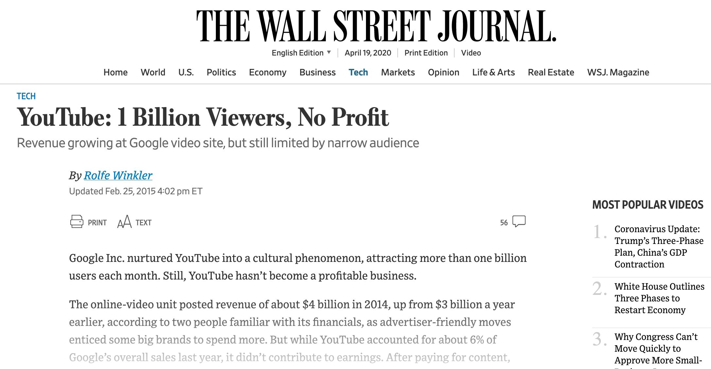
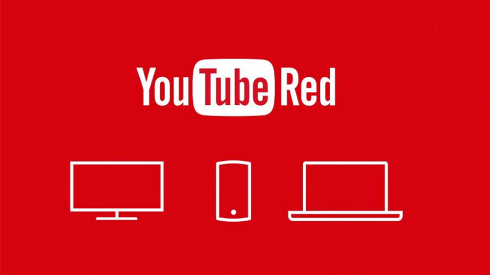
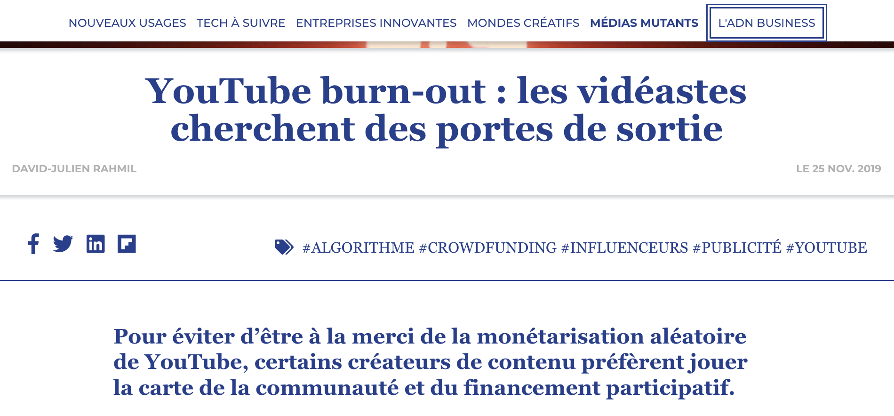
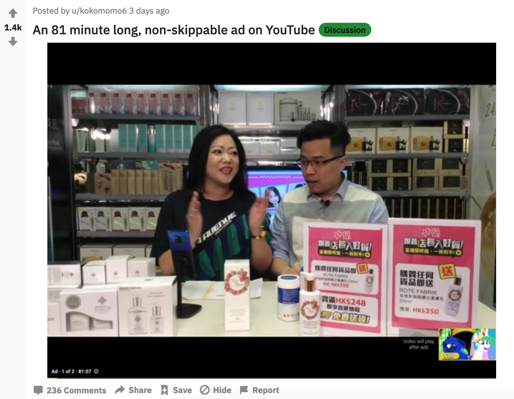
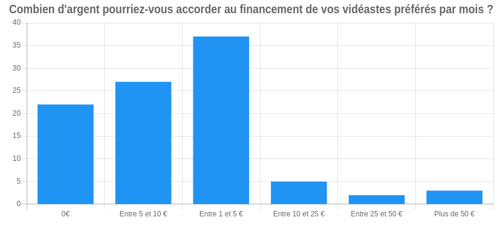
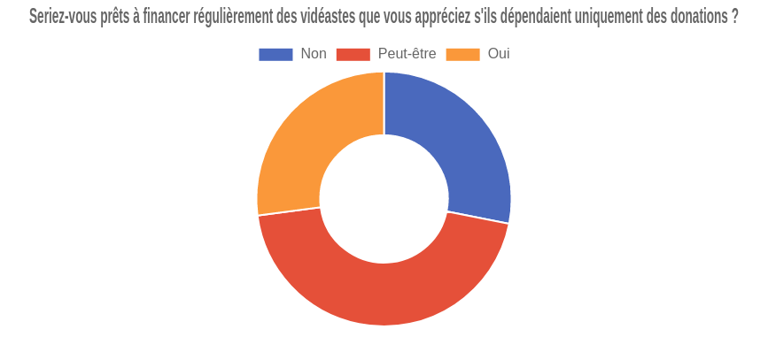
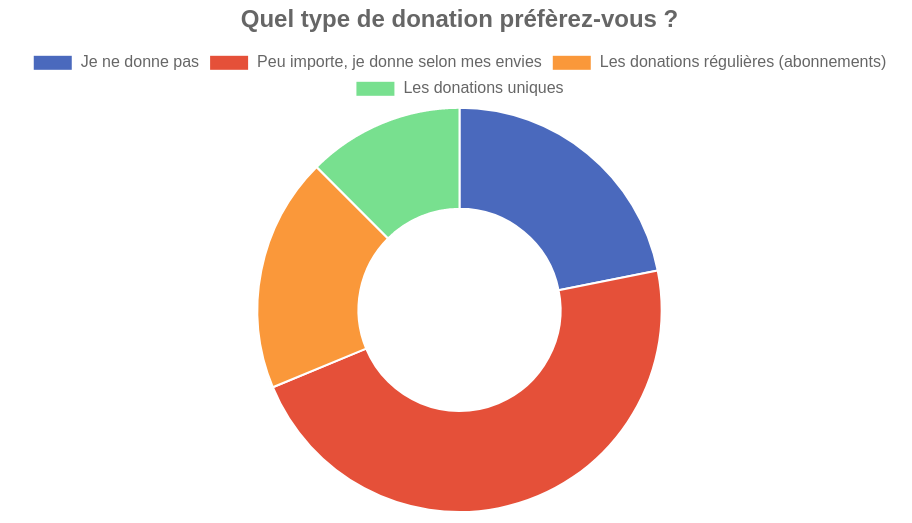

En mai 2005, trois anciens employés de PayPal mettaient en ligne la version beta de YouTube. La plateforme de vidéos, rachetée un an plus tard par Google pour 1,65 milliard de dollars, totalise aujourd'hui plus d'un milliard d'utilisateurs dans le monde et des centaines de millions d'heures de vidéos visionnées chaque jour.

Et pourtant, malgré son incroyable succès, YouTube peine à générer du profit. La plateforme ne générait même aucun profit avant 2015, [selon le Wall Street Journal][2]. Car il faut payer les serveurs, investir dans la maintenance technique, et reverser l'argent aux droits d'auteur (plus d'un milliard de dollars ont ainsi été reversés aux titulaires depuis octobre 2014).

YouTube a donc lancé des initiatives pour augmenter ses revenus. De multiples offres sur mesure ont été lancées pour séduire les annonceurs, avec [de nouveaux formats publicitaires][3] spécialement adaptés aux smartphones, avec un format court de 6 secondes, mais impossible à bloquer ou à fermer.

### YouTube RED

C'est donc à la fois pour entrer dans cette logique et pour monter en gamme que YouTube a annoncé, le 21 octobre 2015, le lancement d'une offre payante, baptisée YouTube Red. YouTube Red entend également s'attaquer au marché de la SVOD. Il promet ainsi des séries originales, à l'instar de House of Cards ou Orange Is the New Black qui ont contribué au succès de Netflix.

YouTube n'est pas le premier service à recourir au modèle économique payant. Le modèle économique de Twitch se base sur les abonnements de chaîne, les chaînes répondant à certains critères sont éligibles à un partenariat avec Twitch ce qui leur permet d'activer l'abonnement payant de 4,99€ par mois. Pour 8,49€ par mois, l'offre YouTube Red propose aux spectateurs :

- Des vidéos et musiques sans publicité
- Accès à des programmes originaux
- Un service de musique à la demande
- Visionnage et écoute hors connexion
- Visionnage en fond sur mobile

L'arrivée de cette offre à notamment permis à YouTube d'augmenter le nombre de publicités pour inciter les utilisateurs à passer sur la version payante du site.

<blockquote class="twitter-tweet">
Is the point of these annoying ads is to buy YouTube Red to get rid of em? Because it&#39;s making me wanna do it <a href="https://t.co/fd2E6JBXzz">pic.twitter.com/fd2E6JBXzz</a>
&mdash; Ket (@NovaKet12) <a href="https://twitter.com/NovaKet12/status/1254033178257481734?ref_src=twsrc%5Etfw">April 25, 2020</a></blockquote> 

Traduction :

>Est-ce que l'objectif de ces publicités intrusives est de me faire souscrire à YouTube Red pour les enlever ? Parce que ça m'en donne vraiment l'envie.

### Les limites de la publicité

Avec le modèle économique actuel de YouTube, ce sont les annonceurs qui ont le pouvoir sur la rémunération des créateurs de contenu. De ce fait, à cause de polémiques comme [celles autour du YouTuber Logan Paul][8] par exemple, les annonceurs se sont montrés plus réticents envers YouTube, car ils ne veulent pas que leur image de marque soit assimilée comme étant en accord avec ce type de contenu. YouTube se voit donc dans l'obligation de diminuer les seuils de monétisation et de réstreindre l'accès à celle-ci avec des critères plus précis.

[Tweet d'Amixem, vidéaste français][7] [[archive][7_archive]]

Le 25 Novembre 2019, un article parait sur l'ADN à propos des créateurs subissants la pression de YouTube concernant la monétisation de leurs vidéos. Expliquant que ces derniers doivent avoir recours à l'aide de leur communauté pour continuer à vivre de cette activité.

    <a href="https://web.archive.org/web/20200229093359/https://www.ladn.eu/media-mutants/tv-et-nouvelles-images/comment-youtubeurs-font-financer-communaute/" target="_blank">Article de David-Julien Rahmil sur l'ADN</a>

>Imaginez que chaque matin vous alliez au travail sans vraiment savoir ce qu’on attend de vous. Vos horaires de bureau changent tout le temps et vous effectuez des tâches sans savoir si c’est ce que votre boss attend de vous. Par ailleurs, ce dernier ne vous paye jamais la même somme et change les termes de votre contrat sans vous dire vraiment quelles sont les règles précises. Tout ce que vous savez, c’est qu’il faut toujours produire plus, pour espérer lui plaire et assurer un salaire minimum pour vivre.

Dans un [autre article paru le 16 Mai 2019](https://www.ladn.eu/media-mutants/tv-et-nouvelles-images/amixem-youtube-surtout-plaire-algorithme/) sur l'ADN, [Amixem](https://www.youtube.com/user/FPSCoopGameplays), raconte comment son métier a évolué.

>Les règles du jeu ne sont plus du tout les mêmes. La première chose à prendre en compte, c’est bien évidemment l’algorithme de YouTube. On peut même dire qu’il a un pouvoir de vie ou de mort sur les youtubeurs.

>Le but pour YouTube est de garder les internautes le plus de temps possible sur la plateforme. Ils vont donc regarder le nombre de minutes visionnées pour chaque vidéo. Si les gens restent plus longtemps, alors ton contenu est davantage propulsé. Avec ce système, on ne peut pas vraiment tricher.

Son témoignage indique que les annonceurs sont en réalité ceux qui décident de leur rémunération de par le pouvoir qu'ils ont sur les publicités affichées sur la plateforme. En effet, la publicité représentant la majeur partie des revenus générés par la plateforme, les annonceurs ont acquis au fil des années une place importante dans l'écosystème et le fonctionnement de YouTube. Leurs choix peuvent donc s'avérés critiques pour la rémunération des vidéastes.

<i>"Une publicité YouTube de 81 minutes, impossible à passer"</i> - <a href="https://www.reddit.com/r/youtube/comments/gckm4b/an_81_minute_long_nonskippable_ad_on_youtube/">Discussion Reddit</a> dans <strong>/r/youtube</strong>

### La souscription de chaîne payante

Depuis peu, il est également possible de s'abonner mensuellement à une chaîne pour environ 4,99€ par mois. Cet argent est en grande partie reversé au vidéaste qui propose des avantages en contre partie. Parmis ces avantages, figurent :

- Des badges exclusifs pour l'espace commentaire
- Des emojis personnalisées pour l'espace commentaire

Et d'autres avantages propres au vidéaste comme l'accès à un groupe de discussion privé, ou du contenu exclusif.

>Via des paiements mensuels, la souscription vous permet d'acheter des badges publics et des emoji, ainsi que d'accéder aux avantages ponctuellement offerts par les créateurs sur le site et l'application YouTube. Source: [Souscrire à une chaîne YouTube](https://support.google.com/youtube/answer/6304294?hl=fr)

De plus en plus adoptés par les créateurs, ces abonnements payants permettent aux créateurs de dépendre de moins en moins de la publicité et d'assurer une rémunération plus stable grâce au support direct de leur communauté. Un pas de plus vers leur indépendance financière, de plus en plus indispensable aujourd'hui face à la pression mise par la plateforme de Google.

En effet les internautes sont de plus en plus sensibles aux problèmes des vidéastes et donc plus ouverts à l'idée de supporter financièrement leur créateurs préférés. Selon notre étude, plus de deux tiers des spectateurs seraient prêts à accorder entre 1 et 5€ par mois pour supporter leurs vidéastes favoris. Contre moins d'un quart qui ne souhaitent pas donner.

Quant à l'idée d'aider les créateurs qui dépendent entièrement des donnations, une majorité de spectateurs déclarent être prêts à les soutenir. Près de la moitié des sondés se sont montrés hésitants face à la question, ce qui laisse penser que cette aide est soumise à des conditions, en voici quelques exemples basés sur des chaînes existantes :

- Contrepartie du créateur, contenu exclusif
- Garantie de qualité, ponctualité, sérieux
- Faisabilité du projet et ambition
- Transparence, communication, proximité

Nous pouvons voir que les internautes sont déjà habitués à donner, régulièrement ou non pour supporter leur créateurs favoris. Il est donc important pour eux d'avoir le choix de la méthode de paiement : donnation régulière, donnation unique.

### Placement de produit

Le placement de produit est une méthode de financement alternative impliquant généralement une marque et un créateur. Certaines marques font appel à des créateurs qui touchent une audience qui les intéresses et leur propose d'effectuer un partenariat pour une ou plusieurs vidéos afin de promouvoir leur(s) produit(s) en l'échange d'une rémunération.

>Il s'agit d'une voie importante de monétisation pour les youtubeurs et ceci d'autant plus depuis que les revenus publicitaires YouTube ont chuté. Le placement produit sur YouTube n'est pour l'instant pas encadré spécifiquement par la loi au même titre que le placement produit en télévision. Le cadre général de la Loi relative à la publicité impose cependant une mention du caractère commercial et payé de la présence du produit et l'ARPP a formulé des recommandations. Source: [Placement produit YouTube](https://www.definitions-marketing.com/definition/placement-produit-youtube/)

YouTube émet également des recommandations relativement précises sur le sujet et a prévu une case de déclaration d'usage du placement produit qui lorsqu'elle est activée déclenche l'affichage d'une mention en surimpression de la vidéo.

Le format peut également présenter certaines limites ou dangers :

- Perception des abonnés aux chaines
- Effet de saturation
- Réalité des vidéos vues

Malgré les abus de certaines marques et les conditions de partenariat souvent malhonnêtes, le placement de produit s'est imposé comme moyen de financement alternatif, fiable et lucratif pour les créateurs. Certaines chaînes ont même habitué leurs spectateurs à visualiser du contenu sponsorisé. Les spectateurs étant de plus en plus compréhensifs vis à vis de la situation financière des vidéastes, cette pratique s'est démocratisée et n'est plus mal vue par la communauté qui ne demande que de la transparence en échange.

----

### Ressources

- [Un an après... YouTube bouleverse son modèle économique][1] [[archive][1_archive]]
- [YouTube: 1 Billion Viewers, No Profit][2] [[archive][2_archive]]
- [Les Formats de Publicité sur Youtube][3] [[archive][3_archive]]
- [Placement produit YouTube][4] [[archive][4_archive]]

[1]:https://www.clubic.com/pro/actualite-e-business/actualite-807308-an-youtube-bouleverse-modele-economique.html
[1_archive]:https://www.clubic.com/pro/actualite-e-business/actualite-807308-an-youtube-bouleverse-modele-economique.html

[2]:https://www.wsj.com/articles/viewers-dont-add-up-to-profit-for-youtube-1424897967
[2_archive]:https://www.wsj.com/articles/viewers-dont-add-up-to-profit-for-youtube-1424897967

[3]:https://www.webmarketing-conseil.fr/les-formats-publicite-youtube/
[3_archive]:https://www.webmarketing-conseil.fr/les-formats-publicite-youtube/

[4]:https://www.definitions-marketing.com/definition/placement-produit-youtube/
[4_archive]:https://www.definitions-marketing.com/definition/placement-produit-youtube/

[7]:https://twitter.com/_Amixem/status/953612321707917312
[7_archive]:https://web.archive.org/web/20200418145846/https://twitter.com/_Amixem/status/953612321707917312

[8]:https://www.forbes.com/sites/natalierobehmed/2018/12/03/how-youtube-star-logan-paul-made-14-5-million-amid-scandal/#3ca134026b2d
